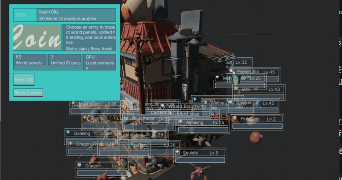
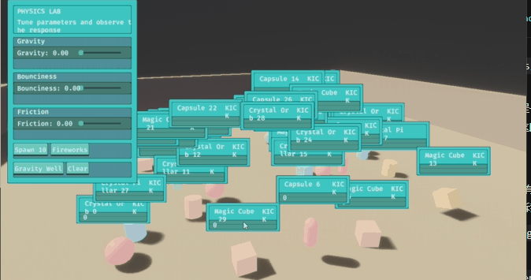

# bevy-nui-plugins

`bevy-nui-plugins` 是 Bevy 与 Neon3 声明式 UI 之间的集成插件。Bevy 继续
拥有游戏 ECS、实体、组件、相机和业务状态；Neon3 负责 NUI 文档解析、布局、
文字、命中测试和最终 UI 像素。两边通过 Neon3 的类型化 IPC/协议通信。

## 提供什么

- `Neon3BevyPlugin`：连接或自动启动 Neon3 UI/WGPU 服务，并注册 Bevy 主世界、
  RenderApp、输入和传输系统。
- `NeonScreenUi<V>`：同步固定屏幕位置的 UI 变量。
- `NeonWorldUi<V>`：同步绑定到 Bevy 实体的世界空间 UI，以及屏幕坐标、相机距离
  和遮挡模式。
- `NuiFlowVars` / `nui_flow_vars!`：把 Rust 结构体字段映射到 NUI `input` 变量，
  支持完整快照、稀疏 diff 和 UI 到 Bevy 的类型检查写回。
- `Neon3SemanticIntentEvents`：接收 NUI 按钮、指针和语义交互事件，供 ECS 系统
  处理。
- `Neon3ExternalImage`：把 Bevy 中 CPU 可读的 RGBA8 图片上传给 Neon3 UI。
- Windows D3D12 外部 surface：把 Neon3 共享的颜色/深度目标导入 Bevy，完成 UI
  合成和世界遮挡。

## 环境和限制

- 当前依赖 Bevy `0.19.1` 和 Neon3 `0.2.0`。
- 默认的 `AutoHeadless` 服务模式目前只支持 Windows；Windows 渲染路径使用
  D3D12 外部纹理互操作。
- 默认端口是 WGPU `127.0.0.1:39103`、UI `127.0.0.1:39102`。端口被占用时，
  请修改 `Neon3BevyConfig`，或者使用 `External` 模式连接已有服务。
- 插件默认会自己启动本地 Neon3 服务，不需要再手动启动一个重复的服务。

## 安装

在 Bevy 应用的 `Cargo.toml` 中加入：

```toml
[dependencies]
bevy = "0.19.1"
bevy-nui-plugins = "0.1.1"
```

如果要直接使用本地 checkout 测试：

```toml
[dependencies]
bevy = "0.19.1"
bevy-nui-plugins = { path = "../bevy-nui-plugins" }
```

## 最小 `main.rs`

`DefaultPlugins` 必须先加入，因为插件需要 Bevy 的 RenderApp。最小可运行入口
如下：

```rust
use bevy::prelude::*;
use bevy_nui_plugins::Neon3BevyPlugin;

fn main() {
    App::new()
        // 先创建窗口、渲染器和 RenderApp。
        .add_plugins(DefaultPlugins)
        // 再加载 Neon3 插件；默认自动启动本地 headless 服务。
        .add_plugins(Neon3BevyPlugin::default())
        .run();
}
```

启动：

```text
cargo run
```

默认 UI 文档是仓库中的 `assets/ui/ordinary-status.nui`。它会显示固定屏幕 UI，
并把鼠标指针事件转发给 Neon3。插件会在构建阶段启动服务，在服务健康后提交 UI
源和 surface。

## 推荐的应用入口

下面的入口同时准备一个 3D 相机、一个屏幕 UI 实体和一个世界 UI 实体。它使用
仓库内的 `character-status.nui`，因此要把该文件复制到应用自己的
`assets/ui/character-status.nui`，或者替换成应用自己的 NUI 源文件。

```rust
use bevy::prelude::*;
use bevy_nui_plugins::{
    CharacterStatusScreenKey, CharacterStatusVars, Neon3BevyConfig, Neon3BevyPlugin,
    NeonScreenUi, NeonWorldUi, NuiFlowIdentity, WorldUiOcclusion,
};

fn main() {
    let mut config = Neon3BevyConfig::default();
    config.world_ui = true;
    config.ui_sources = vec![
        std::fs::read_to_string("assets/ui/character-status.nui")
            .expect("read character-status.nui"),
    ];

    App::new()
        .add_plugins(DefaultPlugins)
        .add_plugins(Neon3BevyPlugin::new(config))
        .add_systems(Startup, setup)
        .run();
}

fn setup(mut commands: Commands, bridge: Res<bevy_nui_plugins::CharacterStatusBridge>) {
    commands.spawn((
        Camera3d::default(),
        Transform::from_xyz(0.0, 2.0, 8.0).looking_at(Vec3::ZERO, Vec3::Y),
    ));

    let vars = CharacterStatusVars {
        health: 82.0,
        mana: 64.0,
        level: 12,
    };

    commands.spawn((
        NeonScreenUi::new(
            "character-status",
            vars.clone(),
            bridge.identity.clone(),
        ),
        CharacterStatusScreenKey,
    ));

    commands.spawn((
        Transform::from_xyz(0.0, 1.0, 0.0),
        NeonWorldUi {
            flow: "character-status".into(),
            vars,
            identity: NuiFlowIdentity {
                program_revision: bridge.identity.program_revision.clone(),
                expected_input_revision: bridge.identity.expected_input_revision,
                request_sequence: 0,
            },
            anchor: "player.main".into(),
            offset: Vec3::Y,
            sent: None,
            visible: true,
            occlusion: WorldUiOcclusion::DepthTested,
        },
    ));
}
```

`Neon3BevyPlugin` 已经插入 `CharacterStatusBridge` 资源。上面的 `setup` 从它取
初始的 `NuiFlowIdentity`，避免手动猜测 program revision 和 input revision。
实际游戏中通常应把 `NeonScreenUi` / `NeonWorldUi` 的 `vars` 绑定到自己的 ECS
状态，并在状态变化时更新字段。

## 服务模式

### 自动启动本地服务

默认配置等价于：

```rust
use bevy_nui_plugins::{Neon3BevyConfig, Neon3ServiceMode};

let mut config = Neon3BevyConfig::default();
config.service_mode = Neon3ServiceMode::AutoHeadless;
config.auto_start_services = true;
```

`AutoWindowed` 会启动可见的 Neon WGPU 窗口和 UI forwarder：

```rust
config.service_mode = Neon3ServiceMode::AutoWindowed;
```

### 连接外部服务

如果服务由启动器、编辑器或其他进程管理，禁止插件重复启动：

```rust
use bevy_nui_plugins::{Neon3BevyConfig, Neon3ServiceMode};

let mut config = Neon3BevyConfig::default();
config.service_mode = Neon3ServiceMode::External;
config.auto_start_services = false;
// 如端口不是默认值，同时修改：
// config.wgpu_endpoint = "127.0.0.1:39103".parse().unwrap();
// config.ui_endpoint = "127.0.0.1:39102".parse().unwrap();
```

## NUI 源文件

`Neon3BevyConfig::ui_sources` 保存的是 NUI **源文本**，不是文件路径。插件会逐个
调用 `ui.flow.submit` 提交它们：

```rust
let mut config = Neon3BevyConfig::default();
config.ui_sources = vec![
    std::fs::read_to_string("assets/ui/my-ui.nui").expect("read my-ui.nui"),
];
```

世界 UI 的 NUI 源至少需要声明 `flow` 和 `world panel`，并且 `anchor` 要与
`NeonWorldUi::anchor` 对应。`world_ui = true` 后，插件会将相机帧和世界锚点批次
使用同一个 frame sequence 提交，避免 UI 锚点和相机状态错配。

## 在 ECS 中读取交互事件

插件会把已解析的语义事件放入 `Neon3SemanticIntentEvents`，应用系统可以按语义
类型过滤：

```rust
use bevy::prelude::*;
use bevy_nui_plugins::{
    semantic_intent_targets, CharacterStatusScreenKey, Neon3SemanticIntentEvents,
};

fn handle_ui_events(mut events: ResMut<Neon3SemanticIntentEvents>) {
    for event in events.drain() {
        if semantic_intent_targets::<CharacterStatusScreenKey>(&event) {
            info!("UI intent={} payload={}", event.intent, event.payload);
        }
    }
}
```

也可以直接读取：

- `Neon3PointerEvents`：像素坐标、按钮、修饰键、指针序号和 frame 序号。
- `Neon3VariableEvents`：UI 发出的变量事件。
- `Neon3InputChanges`：应用准备发送给 NUI 的最新变量值。
- `Neon3IntentQueue`：应用准备发送给 Neon3 的语义意图。

## 图片上传

仅 CPU 可读的单层 2D `Rgba8Unorm` / `Rgba8UnormSrgb` 图片可以跨进程上传：

```rust
use bevy::prelude::*;
use bevy_nui_plugins::Neon3ExternalImage;

fn setup_image(mut commands: Commands, server: Res<AssetServer>) {
    let image = server.load("ui/avatar.png");
    commands.spawn(Neon3ExternalImage::new("player-avatar", image));
}
```

图片资源的句柄仍由 Bevy 管理；插件只传输解码后的 RGBA8 数据。也可以使用
`Neon3ExternalImage::with_region([x, y, width, height])` 上传源图的一部分。

## 常见问题

### 为什么只加入 `Neon3BevyPlugin` 会失败？

插件必须在 `DefaultPlugins` 之后加入。它会注册 RenderApp 的外部 surface 合成
系统，没有 Bevy 渲染子 App 时无法完成初始化。

### 为什么启动时提示服务不健康？

检查 Windows 防火墙、端口 `39102/39103`、图形驱动和 D3D12。若服务已经由其他
进程启动，改用 `Neon3ServiceMode::External`，并确认 `ui_endpoint` 和
`wgpu_endpoint` 与服务一致。

### 世界 UI 为什么不显示？

确认 `world_ui = true`，场景中存在一个 `Camera3d`，相机使用透视投影，实体带有
`Transform` 和 `NeonWorldUi`，并且 NUI 源中的 anchor、flow 与 Rust 组件一致。
`DepthTested` 还需要可用的 Bevy scene depth；排查遮挡时可以先改成
`WorldUiOcclusion::AlwaysVisible`。

## 本地验证

在本仓库根目录执行：

```text
cargo test --lib
cargo check
```

测试覆盖 NUI 源解析、变量快照和 diff、类型写回、世界 UI row key、相机/锚点
frame 配对和 RGBA8 图片边界。真正启动图形服务的最小入口使用上面的 `main.rs`；
它需要 Windows D3D12 环境和可用的 Neon3 本地服务端口。

## Showcase




完整的物理场景和 screen/world UI 组合示例参见 `bevy-nui-host` 示例仓库。
